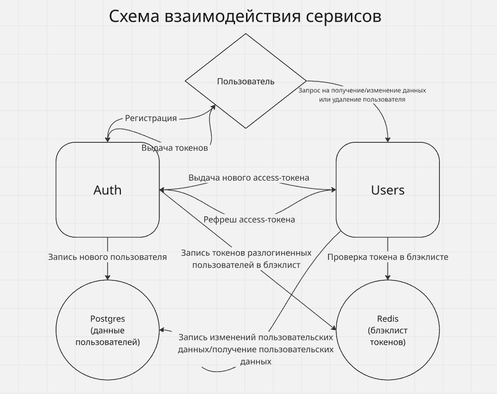
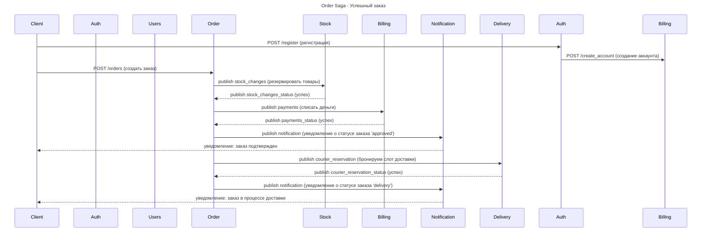
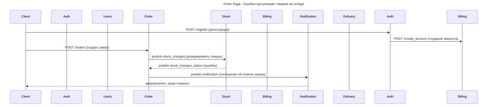
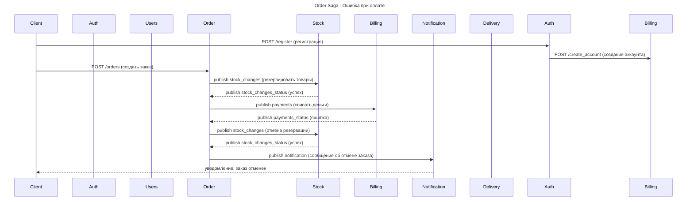
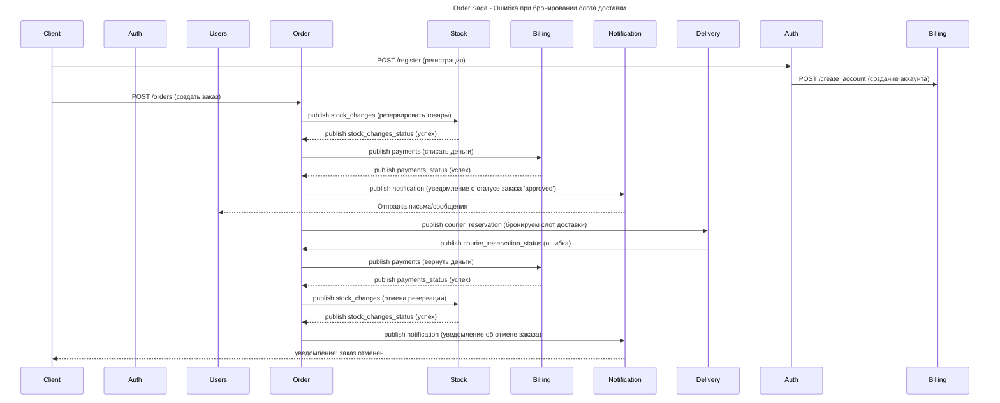

# miniapp

## Описание сервисов

На данный момент miniapp включает в себя следующие сервисы:

1) Auth - сервис для авторизации и аутентификации
2) Users - сервис для управления данными пользователя
3) Stock - сервис склада
4) Billing - сервис обработки платежей
5) Order - сервис заказа
6) Notifications - сервис уведомлений
7) Delivery - сервис доставки.

Спеки OpenAPI и AsyncAPI сервисов можно изучить в папке [spec](./spec).

Примеры запросов и ответов можно посмотреть в [тестах](./miniapp/tests)

## Схема авторизации и аутентификации на примере сервиса Users



## Auth

Отвечает за авторизацию и аутентификацию пользователей в системе, использует механизм выдачи, валидации и обновления `access-token` и `refresh-token`.
Токены имеют вид JWT и генерируются на основе приватного RSA-ключа, который парсится из pem-файла на стороне сервиса **auth**(файл монтируется в поды как Secret).

1) **POST** `/register` - регистрация нового пользователя, генерация `access-token` и `refresh-token`, установка acess-token в заголовок `'Authorization: Bearer {access_token}'`, установка refresh-token в куку через заголовок `'Set-Cookie: refresh_token={refresh_token}'`.
2) **POST** `/login` - вход в систему для существующего пользователя, генерация и выдача пользователю новых `access-token` и `refresh-token` по такому же принципу, как для `/register`
3) **GET** `/logout` - выход пользователя из системы: `access-token` и `refresh-token` заносятся в BlackList(хранится в Redis), по которому будет проверяться, действительны ли токены, с которыми пользователь отправляет запросы к системе
4) **GET** `/refresh` - генерация нового `access-token` в случае протухания старого на основе `refresh-token`. Время жизни `access-token` - 15 мин, время жизни `refresh-token` - 30 дней. Токены передаются пользователю тем же способом, что и в `/register`.

Токены используют в Claims часть данных пользователя, поэтому **auth** также ходит в БД для получения этих данных в случае генерации новых токенов. Также сервис ходит в БД при регистрации нового пользователя.

При всех запросах проверяется `access-token`, если он корректный - отвечаем на запрос 2xx.
Токен протух - посылаем запрос к **auth/refresh** и при успешном получении токена отвечаем на запрос 2xx.
Не валидный токен или не удалось его обновить - отвечаем 401.
Токен дополнительно проверяется на его наличие в BlackList - так мы гарантируем, что при выполненном **auth/logout** требуется новый `access-token`, который можно получить через запрос к **auth/login**.

Также существует система ролей, которая позволяет разделить доступ к ручкам в сервисах. Роль вшивается в claims access-token и проверяется на стороне сервиса, к которому делается запрос.

## Users 

Отвечает за управление данными пользователя в системе, для валидации доступа к данным используется сервис **auth**.

1) **GET** `/user` - получение данных пользователя
2) **POST** `/user` - изменение данных пользователя
3) **DELETE** `/user` - удаление пользователя

## Stock

Отвечает за хранение информации о товарах, доступных для заказа. Производит резерв и rollback товаров на складе при обработке заказа.

1) **POST** `/add_item` - добавление товара на склад
2) **POST** `/update_item` - обновление свойств товара на складе
3) **POST** `/stock_change` - добавление или удаление товара на складе
4) **GET** `/get_items` - получение списка товаров на складе. **TODO**: добавить пагинацию и фильтры.
5) **POST** `/get_stock_changes`(админская ручка) - получение списка действий(резерв/отмена резерва) со складом для переданного номера заказа.

## Billing

Отвечает за обработку платежей при заказе.

1) **POST** `/create_account` - создание аккаунта для пользователя, вызывается сервисом **Auth** при регистрации
2) **GET** `/get_balance` - получить баланс текущего пользователя
3) **POST** `/add_money` - пополнить баланс текущего пользователя
4) **POST** `/get_payments`(админская ручка) - получение списка действий(списание, возврат средств) с балансом пользователя для переданного номера заказа.

## Order

Отвечает за создание и обработку заказов в роли оркестратора.

1) **POST** `/create_order` - создать новый заказ. После создания заказа идет обработка резерва товаров на складе, обработка платежа и отправка уведомлений о статусе заказа. Механизм описан ниже вместе со всеми сценариями.
2) **GET** `/get_orders` - получить информацию о всех заказах пользователя. **TODO**: добавить пагинацию и фильтры.

## Notifications

Отвечает за отправку уведомлений пользователю о статусе заказа

1) **GET** `/get_notifications` - получить список уведомлений пользователя. **TODO**: добавить пагинацию и фильтры.

## Delivery

Отвечает за подбор курьеров для доставки заказов. Курьер резервируется на час времени для доставки одного заказа. Расписание на завтрашний день вставляется в БД по крон-скрипту.

1) **POST** `/add_courier`(админская ручка) - добавить нового курьера в систему, можно задать имя курьера.
2) **POST** `/get_courier_reservations`(админская ручка) - получить список действий по бронированию курьеров для переданного номера заказа.
3) **POST** `/confirm_delivered`(админская ручка) - подтвердить выполнение заказа, прожимается админом после физического отчета курьером о доставке.

# Order Saga – Sequence Diagrams

В данной секции описан механизм обработки заказа при помощи паттерна Saga.

Взаимодействие сервисов **Users**, **Auth**, **Order**, **Stock**, **Billing** и **Notifications** через Kafka и REST API с использованием событий в качестве сообщений.

---









## Установка и запуск

Перед запуском обязательно нужны:

1) Секрет с паролем для БД PostgreSQL, например:

```yaml
apiVersion: v1
kind: Secret
metadata:
  name: postgres-secret
type: Opaque
data:
  postgres-password: UXdlcnR5MTIzNCFA
```

2) Секрет с паролем от Redis, например:

```yaml
apiVersion: v1
kind: Secret
metadata:
  name: redis-secret
type: Opaque
data:
  redis-password: UXdlcnR5MTIzNCFA
```

3) Секрет с приватным и публичным ключами для сервиса аутентификации, например:

```yaml
apiVersion: v1
kind: Secret
metadata:
  name: rsa-cert
type: Opaque
data:
  private-key: |
    ...

  public-key: |
    ...
```

Можно взять для тестирования готовые секреты из манифестов и применить их

```bash
kubectl create namespace miniapp
kubectl apply -f manifests/ -n miniapp
```


Секреты должен находиться в том же namespace, что и устанавливаемый chart

```bash
helm repo add miniapp https://maksonday.github.io/miniapp/
helm install miniapp -n miniapp miniapp/miniapp --set postgresql.auth.existingSecret=postgres-secret --set redis.auth.existingSecret=redis-secret --set auth.existingSecret=rsa-cert --set redis.auth.existingSecretPasswordKey=redis-password
```

## Тестирование

```bash
newman run miniapp/tests/pattern_Saga.postman_collection.json --delay-request 3000 # тестируем сценарии и откат при ошибках
newman run miniapp/tests/services_rest.postman_collection.json --delay-request 5000 # тестируем заказ
newman run miniapp/tests/auth_and_api.postman_collection.json # тестируем создание пользователя и аккаунта + авторизацию и аутентификацию
```