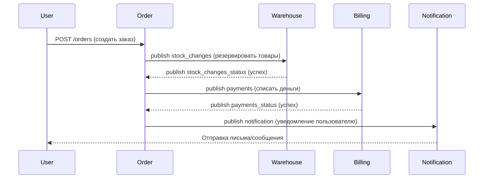
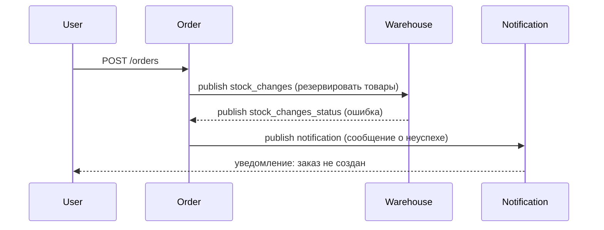
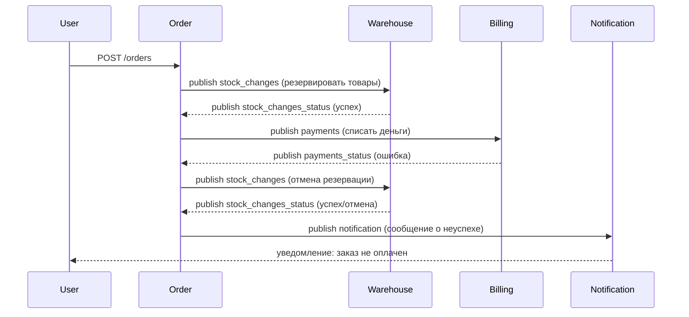

# miniapp

## Описание сервисов

На данный момент miniapp включает в себя следующие сервисы:

1) auth - сервис для авторизации и аутентификации
2) users - сервис для управления данными пользователя

## Схема взаимодействия сервисов


**auth** отвечает за авторизацию и аутентификацию пользователей в системе, использует механизм выдачи, валидации и обновления `access-token` и `refresh-token`.
Токены имеют вид JWT и генерируются на основе приватного RSA-ключа, который парсится из pem-файла на стороне сервиса **auth**(файл монтируется в поды как Secret).

1) **POST** `/register` - регистрация нового пользователя, генерация `access-token` и `refresh-token`, установка acess-token в заголовок `'Authorization: Bearer {access_token}'`, установка refresh-token в куку через заголовок `'Set-Cookie: refresh_token={refresh_token}'`.
2) **POST** `/login` - вход в систему для существующего пользователя, генерация и выдача пользователю новых `access-token` и `refresh-token` по такому же принципу, как для `/register`
3) **GET** `/logout` - выход пользователя из системы: `access-token` и `refresh-token` заносятся в BlackList(хранится в Redis), по которому будет проверяться, действительны ли токены, с которыми пользователь отправляет запросы к системе
4) **GET** `/refresh` - генерация нового `access-token` в случае протухания старого на основе `refresh-token`. Время жизни `access-token` - 15 мин, время жизни `refresh-token` - 30 дней. Токены передаются пользователю тем же способом, что и в `/register`.

Токены используют в Claims часть данных пользователя, поэтому **auth** также ходит в БД для получения этих данных в случае генерации новых токенов. Также сервис ходит в БД при регистрации нового пользователя.

**users** отвечает за управление данными пользователя в системе, для валидации доступа к данным используется сервис **auth**.

1) **GET** `/user` - получение данных пользователя
2) **POST** `/user` - изменение данных пользователя
3) **DELETE** `/user` - удаление пользователя

При все перечисленных запросах проверяется `access-token`, если он корректный - отвечаем на запрос 2xx.
Токен протух - посылаем запрос к **auth/refresh** и при успешном получении токена отвечаем на запрос 2xx.
Не валидный токен или не удалось его обновить - отвечаем 401.
Токен дополнительно проверяется на его наличие в BlackList - так мы гарантируем, что при выполненном **auth/logout** требуется новый `access-token`, который можно получить через запрос к **auth/login**.

## Установка и запуск

Перед запуском обязательно нужны:

1) Секрет с паролем для БД PostgreSQL, например:

```yaml
apiVersion: v1
kind: Secret
metadata:
  name: postgres-secret
type: Opaque
data:
  postgres-password: UXdlcnR5MTIzNCFA
```

2) Секрет с паролем от Redis, например:

```yaml
apiVersion: v1
kind: Secret
metadata:
  name: redis-secret
type: Opaque
data:
  redis-password: UXdlcnR5MTIzNCFA
```

3) Секрет с приватными и публичным ключами для сервиса аутентификации, например:

```yaml
apiVersion: v1
kind: Secret
metadata:
  name: rsa-cert
type: Opaque
data:
  private-key: |
    ...

  public-key: |
    ...
```


Секреты должен находиться в том же namespace, что и устанавливаемый chart

```bash
helm repo add miniapp https://maksonday.github.io/miniapp/
helm install miniapp -n miniapp miniapp/miniapp --set postgresql.auth.existingSecret=postgres-secret --set redis.auth.existingSecret=redis-secret --set auth.existingSecret=rsa-cert --set redis.auth.existingSecretPasswordKey=redis-password
```

## Тестирование

```bash
newman run miniapp/tests/auth_and_api_postman_collection.json
```

# Order Saga – Sequence Diagrams

Взаимодействие сервисов **Order**, **Warehouse**, **Billing** и **Notification**  
через Kafka (события) и REST API (инициация).

---

## 1. Основной сценарий (happy path)







